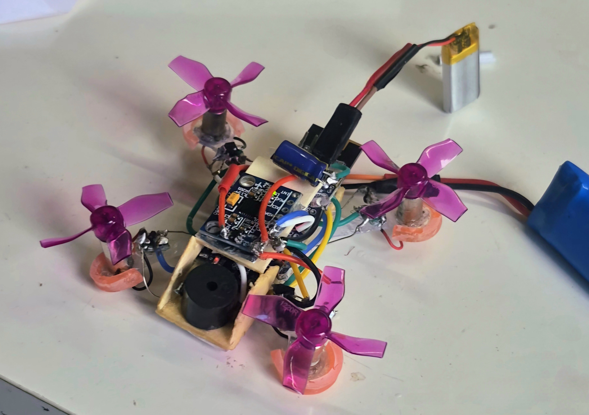

# 🛸 Mini Drone Project

A **DIY mini drone** built with Arduino, 615 coreless motors, and a custom lightweight frame.  
This repository contains **firmware**, **hardware designs**, **wiring diagrams**, and a **step-by-step build guide** to help you make your own.

---

## 📖 Table of Contents
- [Overview](#-overview)
- [Features](#-features)
- [Project Structure](#-project-structure)
- [Bill of Materials](#-bill-of-materials)
- [Wiring Diagram](#-wiring-diagram)
- [Build Instructions](#-build-instructions)
- [Demo Video](#-demo-video)
- [License](#-license)

---

## 📜 Overview
This mini drone was designed for **fun, learning, and experimentation** in micro UAV building.  
The goal was to create a **lightweight, affordable** drone using easy-to-source components, with an **Arduino Nano** as the flight controller and an **NRF24L01+** module for wireless control.

**Flight Controller:** Arduino Nano  
**Motors:** 615 Coreless (37,000 RPM)  
**Props:** 31mm, 4-blade  
**Battery:** 2 × 3.7V 380mAh LiPo in series  
**Frame:** 3D-printed PLA

---

## ✨ Features
- Compact, **lightweight micro quadcopter**
- 2.4GHz NRF24L01 wireless control
- **PID tuning** for stable flight
- Fully open-source firmware & hardware files
- Modular design for easy repairs and upgrades

---

## 📂 Project Structure
